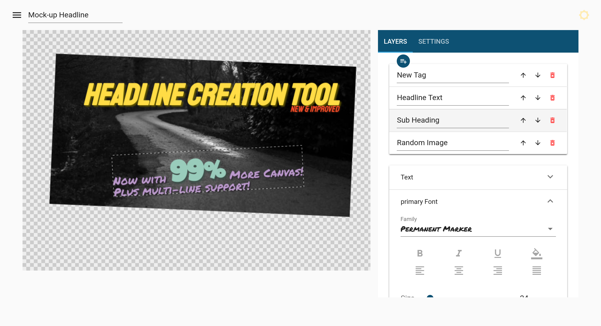

# Headline Creation Tool and Rendering API



Based on the [MEVN stack](https://github.com/aturingmachine/mevn-stack)<br/>
[**M**ongo](https://www.mongodb.com/) [**E**xpress](https://expressjs.com/) [**V**ueJS](https://vuejs.org/) [**N**ode](https://nodejs.org/en/)

## Installation on A2 unmanaged VPS

1. [Get SSH access](https://www.a2hosting.com/kb/getting-started-guide/accessing-your-account/using-ssh-secure-shell)

2. Stop/Disable c-panel & httpd:
```
$ systemctl stop cpanel & systemctl disable cpanel
$ systemctl stop httpd & systemctl disable httpd
```

3. [Install Node.js](https://linuxize.com/post/how-to-install-node-js-on-centos-7/)

4. [Install PM2](http://pm2.keymetrics.io/docs/usage/quick-start/)

5. [Install MongoDB](https://docs.mongodb.com/manual/tutorial/install-mongodb-on-red-hat/#configure-the-package-management-system-yum)

5. Start mongod:
```
$ systemctl start mongod
```

7. Clone repository:
```
$ git clone https://github.com/chpmnrssll/headline-creation-tool.git
$ cd headline-creation-tool
```

8. Setup environment variables:
```
$ cp .env.example .env
```
**Changing the PORT variable in the .env will require you to change it in the `views/config/http.js` file.**

8. Install node_modules
```
$ npm install
```

9. Build for production
```
$ npm run build
```

10. Start the server with PM2
```
$ pm2 start npm -- start
```

The server can be controlled/monitored with PM2:
```
$ pm2 list
$ pm2 monit
$ pm2 stop npm
```

### Local Setup/Development

Edit your environment variables in .env as needed.

To develop using this project you can run
```
$ npm run dev:serve & npm run dev:client
```

This will allow hot reloading of both changes to the server and changes to the client.

The server will require you to be running a local instance of [MongoDB](https://www.mongodb.com/).

`npm run static` will build the client-side JavaScript and start the hot reloading of the server environment.

`npm run dev:serve` can also be used to just start the API if you are working on that prior to worrying about the client.

#### Scripts

A more detailed breakdown of the scripts are as follows:

| Command `npm run`| Server | Client |
| :------------- |:------------- |:-
| `start`| Static| Static (requires `npm run build`)
| `dev:serve`      	| Hot reload | Static
| `dev:client` 		| None | Hot Reload
| `build` | None | Bundled by Webpack
| `static` | Hot reload | Bundled by Webpack

### Project Structure

##### Backend

`/src`

`--/controllers/`-- Contains controllers for our API resources.
`--/database/`
`----/models/`-- Contains the models for our API Resources using [Mongoose](http://mongoosejs.com/).
`--/middleware/`-- Any middleware you may need can go here.
`--/routes/`-- All route definitions are here.
`----/api.js`-- Routes for the API.
`----/user.js`-- Routes specific to the user resource.

##### Frontend

`/views`
`--/config/http.js`-- Axios config for local request
`--/pages/`-- Separate Component Pages go here.
`--/router/index.js`-- Config for [vue-router](https://github.com/vuejs/vue-router)
`--/App.vue`-- Component that has Nav-Drawer, Footer, and Toolbar wrapped around a router view of other components.
`--/main.js`-- Registers the Vue components and Router
`--/index.html`-- The file we return, has the Vue app in it.

### Dependencies

* Dependencies Via NPM
	* [Axios](https://github.com/axios/axios) For client side HTTP requests
	* [cors](https://github.com/expressjs/cors) For CORS during development
	* [dotenv](https://github.com/motdotla/dotenv) Loads our .env variables
	* [vue](https://vuejs.org/) Realtime data binding on the frontend
	* [vuetify](https://vuetifyjs.com/vuetify/quick-start) Material design for Vue
	* [vue-router](https://github.com/vuejs/vue-router) Router for the SPA

### Existing Routes

All user endpoints are behind the `/api` endpoint.

#### `GET`
`/users` - returns a list of all users inside of an array called `data`.
`/users/:id` - where `:id` is the id of a `user` resource. The resource is then returned in JSON format.

#### `POST`
`/users` - Creates a new `user` resource based on the payload of the request.

#### `DELETE`
`/users/:id` - Delete a user resouce matching the `:id` specified.

#### `PUT`
`/users` - Update a user based on the payload of the request
